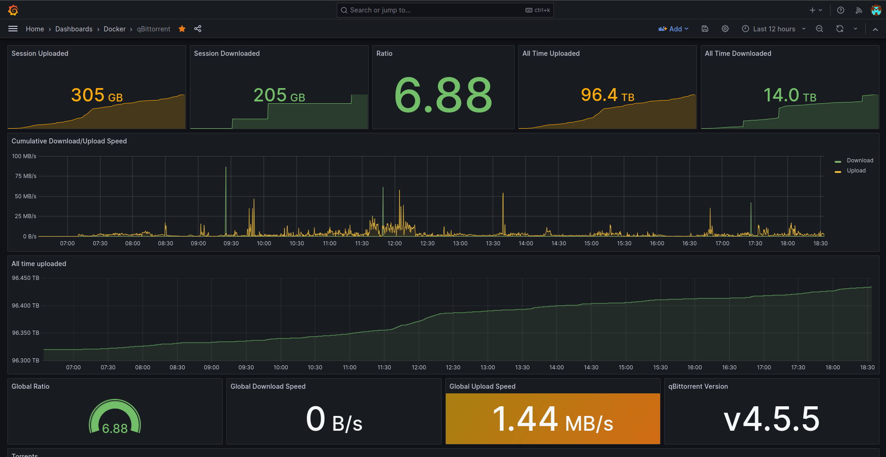
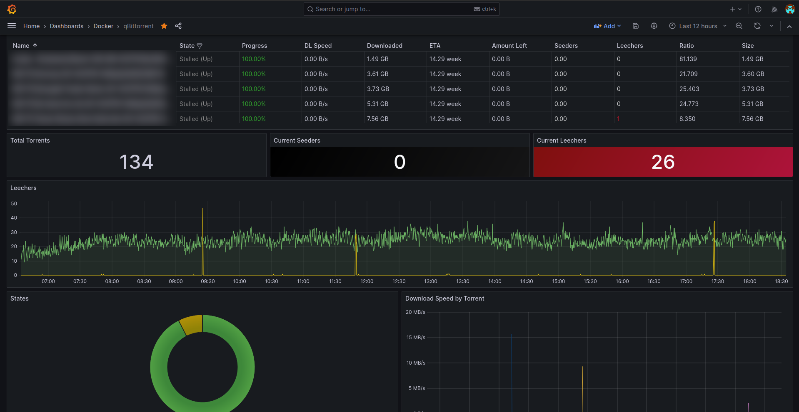

# qbittorrent-exporter

[](https://github.com/martabal/qbittorrent-exporter/actions/workflows/docker.yml)
[](https://github.com/martabal/qbittorrent-exporter/actions/workflows/build.yml)
[](https://github.com/martabal/qbittorrent-exporter/actions/workflows/test.yml)

<p align="center">
 
</p>

This app is a Prometheus exporter for qBittorrent.
You must have version 4.1.0 of qBittorrent or higher.

## Credits

I was using an excellent [exporter](https://github.com/caseyscarborough/qbittorrent-exporter) written in Java and I wanted to learn Go, that's how I got the idea to rewrite the exporter in Go.

Additionally, this project adds support for tags and categories. It tracks the categories and tags of each torrent and the global categories and tags.

## About this App

This app is a lightweight and fast prometheus exporter for qBittorrent, made to be integrated with the [qbittorrent-grafana-dashboard](https://raw.githubusercontent.com/martabal/qbittorrent-exporter/main/grafana/dashboard.json).

## Run it

### Docker-cli ([click here for more info](https://docs.docker.com/engine/reference/commandline/cli/))

```sh
docker run --name=qbittorrent-exporter \
    -e QBITTORRENT_BASE_URL=http://192.168.1.10:8080 \
    -e QBITTORRENT_PASSWORD='<your_password>' \
    -e QBITTORRENT_USERNAME=admin \
    -p 8090:8090 \
    ghcr.io/martabal/qbittorrent-exporter:latest
```

### Docker-compose

```yaml
services:
  qbittorrent-exporter:
    image: ghcr.io/martabal/qbittorrent-exporter:latest
    container_name: qbittorrent-exporter
    environment:
      - QBITTORRENT_BASE_URL=http://192.168.1.10:8080
      - QBITTORRENT_PASSWORD='<your_password>'
      - QBITTORRENT_USERNAME=admin
    ports:
      - 8090:8090
    restart: unless-stopped
```

### Without docker

```sh
git clone https://github.com/martabal/qbittorrent-exporter.git
cd qbittorrent-exporter
go get -d -v
cd src
go build -o ./qbittorrent-exporter
./qbittorrent-exporter
```

or

```sh
git clone https://github.com/martabal/qbittorrent-exporter.git
cd qbittorrent-exporter
go get -d -v
cd src
go run ./src
```

If you want to use an .env file, edit `.env.example` to match your setup, rename it `.env` then run it in the same directory. If you want to force to use the environment variables use `-e` argument like :

```sh
./qbittorrent-exporter -e
```

or

```sh
go run ./src -e
```

## Metrics

You can find in the dashboard the following metrics:

- All time download/upload
- Session download/upload
- Cumulative upload/download speeds
- Global ratio/download speed/upload speed
- qBittorrent version
- Torrent list with statuses
- Total torrents/seeders/leechers
- Torrent state chart
- Amount remaining by torrent
- Incomplete torrent progress
- Download/upload speed by torrent
- Categories
- Tags
- Trackers

## Resources

This app uses ~20 times less RAM compared to the [original exporter](https://github.com/caseyscarborough/qbittorrent-exporter) for the same amount of torrents.
Docker compressed size is ~10 MB.

## Dashboard




## Parameters

### Environment variables

| Parameter                            | Function                                                                                | Default Value           |
|--------------------------------------|-----------------------------------------------------------------------------------------|-------------------------|
| `-p 8090`                            | Webservice port                                                                         |                         |
| `-e QBITTORRENT_USERNAME`            | qBittorrent username                                                                    | `admin`                 |
| `-e QBITTORRENT_PASSWORD`            | qBittorrent password                                                                    | `adminadmin`            |
| `-e QBITTORRENT_BASE_URL`            | qBittorrent base URL                                                                    | `http://localhost:8090` |
| `-e QBITTORRENT_BASIC_AUTH_USERNAME` | Send basic auth username request header (only if username or password are set)          |                         |
| `-e QBITTORRENT_BASIC_AUTH_PASSWORD` | Send basic auth password request header (only if username or password are set)          |                         |
| `-e QBITTORRENT_TIMEOUT`             | Duration before ending a request to qBittorrent                                         | `30`                    |
| `-e EXPORTER_PORT`                   | qBittorrent export port (optional)                                                      | `8090`                  |
| `-e EXPORTER_BASIC_AUTH_USERNAME`    | Use basic auth (only if username and password are set)                                  |                         |
| `-e EXPORTER_BASIC_AUTH_PASSWORD`    | Use basic auth (only if username and password are set)                                  |                         |
| `-e LOG_LEVEL`                       | App log level (`DEBUG`, `INFO`, `WARN`, `ERROR`)                                        | `INFO`                  |
| `-e ENABLE_TRACKER`                  | Get tracker info                                                                        | `true`                  |
| `-e ENABLE_HIGH_CARDINALITY`         | Enable high cardinality metric (`qbittorrent_torrent_info`, `qbittorrent_tracker_info`) | `false`                 |
| `-e ENABLE_LABEL_WITH_HASH`          | **[EXPERIMENTAL]** Add the torrent hash to `qbittorrent_torrent_*` metrics label        | `false`                 |
| `-e EXPORTER_URL`                    | The URL shown in the logs when starting the exporter                                    |                         |
| `-e EXPORTER_PATH`                   | The path where the metrics are exposed                                                  | `/metrics`              |
| `-e DANGEROUS_SHOW_PASSWORD`         | Show the qBittorrent password in logs when starting the exporter                        | `false`                 |
| `-e CERTIFICATE_AUTHORITY_PATH`      | Path to a CA (`.crt`) used to verify the qBittorrent TLS certificate                    |                         |
| `-e INSECURE_SKIP_VERIFY`            | Don't validate the TLS certificate presented by qBittorrent                             | `false`                 |
| `-e MIN_TLS_VERSION`                 | Only connect to qBittorrent if it supports at least this TLS version                    | `TLS_1_3`               |

### Arguments

| Arguments | Function                                                                                                                                               |
| :-------: | ------------------------------------------------------------------------------------------------------------------------------------------------------ |
|    -e     | If qbittorrent-exporter detects a .env file in the same directory, the values in the .env will be used, `-e` forces the usage of environment variables |

### Setup

Add the target to your `scrape_configs` in your `prometheus.yml` file of your Prometheus instance.

```yaml
scrape_configs:
  - job_name: "qbittorrent"
    static_configs:
      - targets: ["<your_ip_address>:8090"]
```

### Contribute

Contributions are welcome! To get started, copy and rename the `.env.example` file to `.env`, move it to the `src` folder, and run `make dev` from the root directory.
